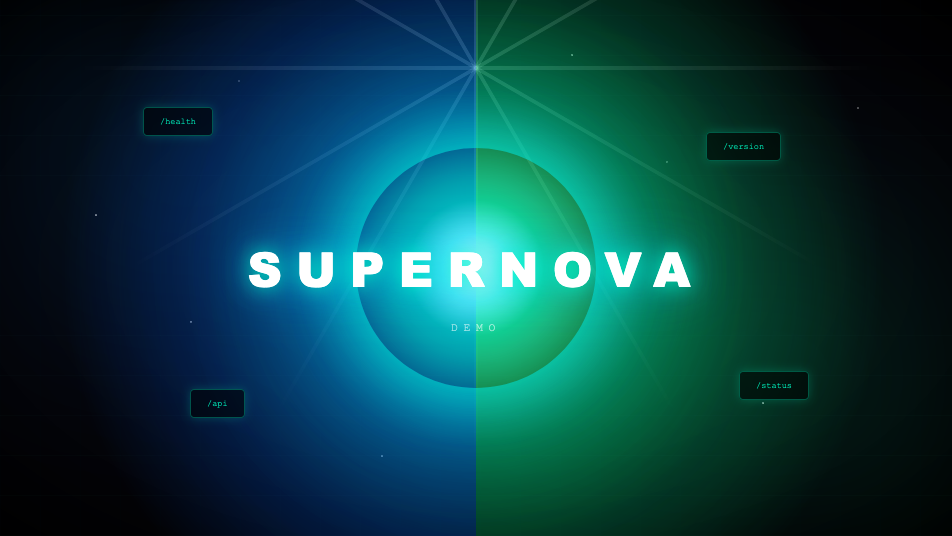

# example-service

[](https://github.com/jcbmcn/example-service/actions/workflows/release.yaml)
[](LICENSE)
[](https://github.com/users/jcbmcn/packages/container/package/example-service)

A small blue/green React + Express demo that serves a themed static build, exposes health/version endpoints, and emits OpenTelemetry traces. Docker images are color-specific via `APP_COLOR`.



## Endpoints
- `/` serves the built React app for the configured color.
- `/health` returns `{"status":"ok","color":"<blue|green>"}`.
- `/version` echoes the color for quick probes.
- `/blue` and `/green` serve the respective supernova image (404 if the build color does not match).

## Quickstart (Node)
```bash
npm ci
npm run dev        # Vite dev server
PORT=3000 APP_COLOR=green npm start  # serve built app with green theme
```

## Containers
- Build locally: `docker build -t example-service:blue --build-arg APP_COLOR=blue .`
- Compose both colors: `docker-compose up --build`
- Pull from GHCR (published by the release workflow):
  - `ghcr.io/jcbmcn/example-service:blue` and `:blue-<version>`
  - `ghcr.io/jcbmcn/example-service:green` and `:green-<version>`

## CI/CD and versioning
- Conventional Commits drive semantic-release (`.releaserc.json`).
- GitHub Actions workflow (`.github/workflows/release.yaml`) runs on `main`, cuts a release, and pushes blue/green images with both floating and versioned tags to GHCR, then appends the image list to the release notes.

## Observability
OpenTelemetry is initialized on boot (`tracing.js`). Configure exporters with:
- `OTEL_EXPORTER_OTLP_TRACES_ENDPOINT` or `OTEL_EXPORTER_OTLP_ENDPOINT` (defaults to Signoz collector URL).
- `OTEL_SERVICE_NAME`, `OTEL_SERVICE_NAMESPACE`.

## Project layout
- `Dockerfile` multi-stage build honoring `APP_COLOR`
- `docker-compose.yml` spins up blue and green services
- `server.js` Express server with health/version routes and image serving
- `src/` React frontend; `assets/` static images
